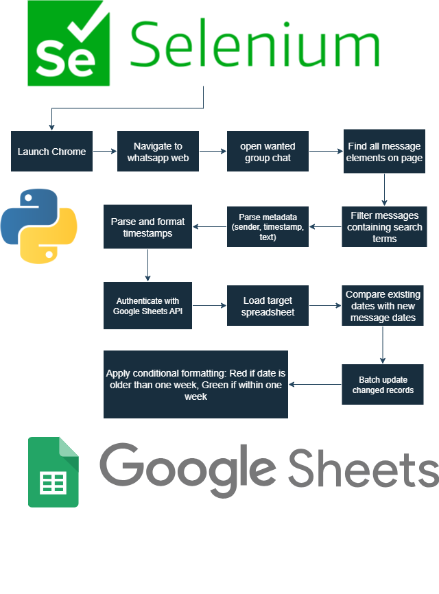

# WhatsApp Auto

An automation tool that connects **WhatsApp Web** with **Google Sheets** using Python and Selenium.

---

## 🚀 Overview

**WhatsApp Auto** automatically reads incoming messages from WhatsApp Web, processes them, and updates a connected Google Sheet — saving you time and keeping your data synchronized.  
It also logs every step and creates a CSV backup for safekeeping.

---

## ✨ Features

- 📥 Reads and extracts WhatsApp messages via Selenium  
- 🧹 Formats and filters message data  
- 📊 Updates Google Sheets automatically  
- 💾 Saves a CSV backup of all message data  
- 🕒 Logs each module’s runtime and overall script duration  
- 🧭 Gracefully exits when no new messages are found  

---

  

---

1. **Clone the repository**
   ```bash
   git clone https://github.com/NVB20/whatsapp-auto.git
   cd whatsapp-auto


## Prerequisites

- Python 3.7 or higher
- Chrome/Chromium browser
- Google account with Sheets API access
- WhatsApp account with access to the target group

## Installation

1. Clone the repository:
```bash
git clone https://github.com/yourusername/whatsapp-assignment-tracker.git
cd whatsapp-assignment-tracker
```

2. Install required dependencies:
```bash
pip install -r requirements.txt
```
### Basic Usage
```bash
python main.py
```

## Contributing

1. Fork the repository
2. Create a feature branch (`git checkout -b feature/new-feature`)
3. Commit your changes (`git commit -am 'Add new feature'`)
4. Push to the branch (`git push origin feature/new-feature`)
5. Create a Pull Request


## Disclaimer

This tool is for educational and administrative purposes only. Ensure you have proper permissions to monitor WhatsApp groups and comply with your institution's privacy policies.

